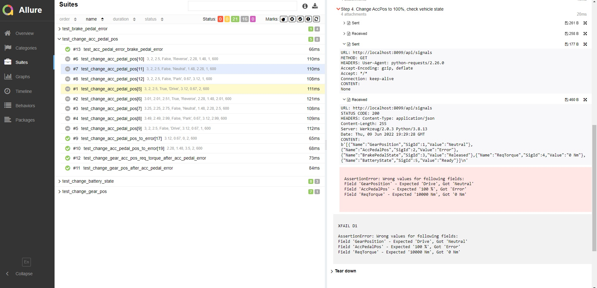

# Probation Task: Alexandr Semenov

## Test-Design
Тест-дизайн приложен в файле `misc/Test Design.xlsx`.
По листам:
- <b>Test Cases</b>: Список тест кейсов. Включает в себя ID тестов, краткое описание проверки, предусловия, шаги теста, ожидаемый результат, ID найденных багов, pass/fail и имя питон файла, в котором расположен тест.
- <b>Decision Table</b>: Таблица всех возможных состояний системы при всех возможных входных параметрах согласно требованиям, на основе которой генерировались ожидаемые результаты.
- <b>EP, BVA</b>: Включает в себя разбивку по классам эквивалентности для значений пинов и анализ граничных значений пинов. Все граничные значения задействованы как минимум один раз в тест кейсах.
- <b>Pairwise Testing</b>: Сопоставление граничных значений нескольких классов эквивалентности одновременно с целью уменьшения количества проверок по граничным значениям, в идеале - недопущения составления тест кейсов, проверяющих только лишь граничные значения.
- <b>Bug Report</b>: Найденные в процессе тестирования дефекты. Включает в себя ID дефекта, краткое описание дефекта, шаги по воспроизведению, ожидаемый результат, фактический результат, зааффекченный компонент, severity, комментарии к дефектам.

## Test Automation Solution
Решение выполнено на языке Python версии 3.10, сопоставимо с версиями 3.7-3.11.
Для запуска тестов необходимо установить зависимости и запустить все тесты в папке tests.
Каждому тесту присвоен <b>ID</b> из списка Test Cases для более удобной навигации, например `@pytest.marks.id("1")` или `@pytest.mark.parametrize( ... , ids=["2", "3"])`. Для тестов, которые заблочены по причине дефектов, сделана пометка со ссылкой на ID дефекта из списка Bug Report: `@pytest.mark.xfail(reason="D1")`.

## Allure Report
Решение имеет поддержку Allure отчетов, для формирования отчета необходимо прогнать тест кейсы с параметрами командной строки `--alluredir=<путь_к_директории>`, после чего выполнить команду `allure serve <путь_к_директории>`. Пример Allure Report:

